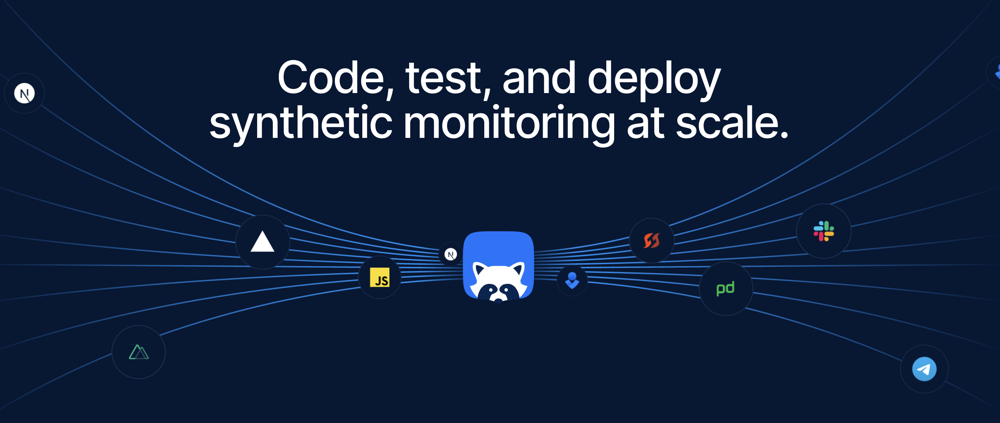

# Checkly GitHub

Build & run synthetics that scale. Monitoring as code workflow for developers: programmable, fast, reliable.

[Home](https://checklyhq.com?utm_source=readme&utm_medium=readme-file&utm_id=github) | [Blog](https://blog.checklyhq.com?utm_source=readme&utm_medium=readme-file&utm_id=github) | [Docs](https://checklyhq.com/docs?utm_source=readme&utm_medium=readme-file&utm_id=github)

